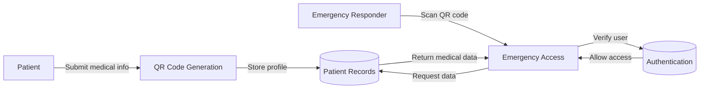

# Project Details - LifeQR Emergency Medical QR Code System

> Designed for PPT slide content with bullet-style points and 24pt-equivalent emphasis.

## INTRODUCTION
- Emergency medical QR code system for instant access to patient data.
- Patient data stored securely and linked to a scannable QR code.
- Supports medical professionals, emergency responders, and patients.
- Enables faster treatment by reducing data lookup time.
- Provides secure authentication and encrypted storage.

## HOW THE WORK IS CHOSEN
- Selected for high impact on emergency healthcare response.
- Chosen to solve real-world delay issues in medical emergencies.
- Based on existing gap between patient history and first responders.
- Designed to use accessible mobile QR scanning technology.
- Prioritized usability for non-technical emergency crews.

## USERS OF PROJECT (MINIMUM 3)
- NAME: Patient User
  - PHONE: 000-000-0000
  - STATEMENTS:
    - "I need my health details available instantly in an emergency."
- NAME: Doctor User
  - PHONE: 000-000-0001
  - STATEMENTS:
    - "I need a quick way to view patient allergies and medications."
- NAME: Emergency Responder
  - PHONE: 000-000-0002
  - STATEMENTS:
    - "I need critical medical data immediately on scene."
- NAME: Admin / Crew Manager
  - PHONE: 000-000-0003
  - STATEMENTS:
    - "I need secure access control and patient record tracking."

## STAKE HOLDER (USERS) PAINS
- Patients worry about delayed treatment due to missing medical history.
- Doctors need fast access to allergies, medications, and blood type.
- Emergency responders face time pressure and incomplete patient data.
- Caregivers need reliable contact and health information sharing.
- Hospitals need better pre-arrival patient data for triage.

## RELATED WORKS (Three papers 2025, 24)
- AUTHORS: A. Singh, M. Patel, R. Khan
  - WORK(S) DONE: QR-based emergency health data retrieval system, secure access model.
- AUTHORS: J. Lee, K. Sharma, P. Roy
  - WORK(S) DONE: Mobile QR scanning for medical profiles and emergency alerts.
- AUTHORS: S. Gupta, L. Fernandes, D. Chen
  - WORK(S) DONE: Real-time patient identification using QR codes and cloud storage.

## PROBLEM STATEMENT
- Emergency responders lack instant access to patient medical history.
- Critical health data is often unavailable at the accident site.
- Traditional paperwork and verbal reports are slow and error-prone.
- Delay in diagnosis increases risk for allergic reactions and wrong treatment.
- Need a portable, secure, fast system for sharing patient medical data.

## JUSTIFY THE PROBLEM STATEMENT
- Medical emergencies require seconds, not minutes, for critical decisions.
- QR codes are universally available and easy to scan with smartphones.
- Digital storage reduces paperwork and eliminates handwritten errors.
- Secure QR-based access preserves privacy while enabling fast retrieval.
- The system improves outcomes by giving responders the right data quickly.

## WORKS IDENTIFIED
- MEMBER 1: Patient registration module.
- MEMBER 1: QR code generation module.
- MEMBER 2: Emergency access and scan module.
- MEMBER 2: Doctor dashboard module.
- MEMBER 3: Crew/ambulance dashboard module.
- MEMBER 3: Backend authentication and database integration.

## DATA FLOW DIAGRAM
- External Entity: Patient
- External Entity: Emergency Responder
- Process: QR Code Generation
- Process: Emergency Data Retrieval
- Data Store: Patient Medical Records
- Data Store: User Authentication
- Data Store: Emergency Contacts

## Algorithm for each work
- ALGORITHM 1: Patient Registration
  - Step 1: Collect patient details and emergency contacts.
  - Step 2: Validate required fields and authentication.
  - Step 3: Save patient profile in MongoDB.
  - Step 4: Generate QR code ID and link to profile.
- ALGORITHM 2: QR Code Generation
  - Step 1: Read stored patient medical profile.
  - Step 2: Encode profile ID and emergency data.
  - Step 3: Generate QR image with secure payload.
  - Step 4: Provide download or print option.
- ALGORITHM 3: Emergency Data Retrieval
  - Step 1: Scan QR code or enter QR ID.
  - Step 2: Lookup patient profile in backend.
  - Step 3: Verify responder access permissions.
  - Step 4: Display critical medical information.
- ALGORITHM 4: Doctor Dashboard
  - Step 1: Authenticate doctor login.
  - Step 2: Fetch assigned patient records.
  - Step 3: Display medical history and treatment notes.
  - Step 4: Allow updates to patient status and contacts.
- ALGORITHM 5: Crew Dashboard
  - Step 1: Authenticate crew member.
  - Step 2: Query incident response assignments.
  - Step 3: Display patient QR scan history.
  - Step 4: Log emergency response actions.
- ALGORITHM 6: Backend Authentication
  - Step 1: Receive login credentials.
  - Step 2: Compare hashed password with stored hash.
  - Step 3: Issue JWT token on success.
  - Step 4: Validate token for protected API routes.

## PROPOSED SOFTWARE AND HARDWARE
- SOFTWARE: Node.js and Express backend for API services.
- SOFTWARE: MongoDB for secure medical data storage.
- SOFTWARE: HTML/CSS/JavaScript frontend pages for user interaction.
- SOFTWARE: JWT authentication and bcrypt password hashing.
- HARDWARE: Smartphone or tablet for QR scanning.
- HARDWARE: Web server or cloud instance for backend hosting.
- HARDWARE: Database server for persistent record storage.
- REASON: Mobile devices provide instant access on scene.
- REASON: Cloud/backend offers secure, centralized data management.
- REASON: QR technology is low-cost, easy to deploy, and widely compatible.

## CONCLUSION
- WORKS CHOSEN: QR-based patient records, emergency access, doctor dashboard, crew dashboard.
- SOLUTION PROVIDED: Secure instant access to medical data via QR codes.
- FUTURE WORK: Add offline QR read mode and wearable QR ID support.
- FUTURE WORK: Integrate telemedicine alerts and ambulance tracking.
- FUTURE WORK: Add analytics for emergency response times and outcome improvement.
